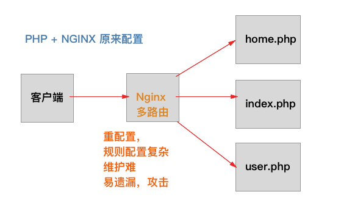
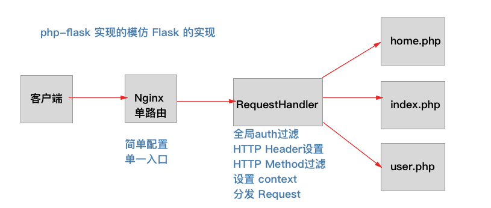

# php-flask
 一个模仿 Flask 的，采用PHP实现的微型框架

## 思路
PHP 是一个多入口的大型程序，具有不太好维护的特点。而且基于`.php`文件后缀访问，容易给黑客造成上传文件形成攻击的漏洞

目前公司实践下来发现了 `PHP + Nginx` 的配置维护起来比较困难，主要是 Ngnix 的灵活性不够，需要编辑规则文件（规则不容易被普通程序员维护）

这里就模仿 Flask 实现一个单一 Webapp 入口的 微型框架，目的是简化 Nginx 配置，实现单一入口管理，过滤防止攻击

## 图谱思路




## 简化后的 Nginx配置

```
server {
    listen 80;
    root /var/www/html;
    server_name example.com;
    
    access_log  syslog:server=xxx.xxx.xxx.xxx:xxx,facility=yourservercofig,tag=nginx,severity=info json;


    location = /path/to/your/folder/index.php { --> index.php 统一入口
        include snippets/fastcgi-php.conf;
        fastcgi_pass 127.0.0.1:9000;
    }

    location ~ /path/to/your/folder/(.+){ --> 简化了，全部去到 index.php 统一入口
        rewrite ^/path/to/your/folder/(.+)$ /path/to/your/folder/index.php?r=$1&$args;
    }

    location / {
        return 404;
    }
}
```

## 简化后的单一 PHP 实现方法 （举例 POST和 GET)
```
<?php
/** 
* DEMO 带有URL 参数匹配的处理
 */
require_once dirname(__FILE__).'/AppRequestHandler.class.php'; // 继承

class PostInfoHandler extends AppRequestHandler{
    function __construct($matched_regex){
        parent::__construct($matched_regex);
    }

    // GET 方法覆盖，有匹配参数
    public function get($matched_regex){
        $pid = intval($matched_regex[1]);
        return tJsonEncode(['success'=>$success, 'message'=>$message, 'code'=>200, 'data'=>$pid]);
    }

    // POST 方法覆盖
    // 无参数
    public function post(){
        if(!$this->is_auth()){
            return tJsonEncode(['success'=>false, 'message'=>'请先登录', 'code'=>500, 'data'=>null]);
        }
        return tJsonEncode(['success'=>$success, 'message'=>$message, 'code'=>200, 'data'=>$pid]);
    }

    // DELETE/OPTIONS/PUT 都需要覆盖对应方法来实现
}
```

## 实用 PHP DEBUG 助手
参见`AppUtils.php`